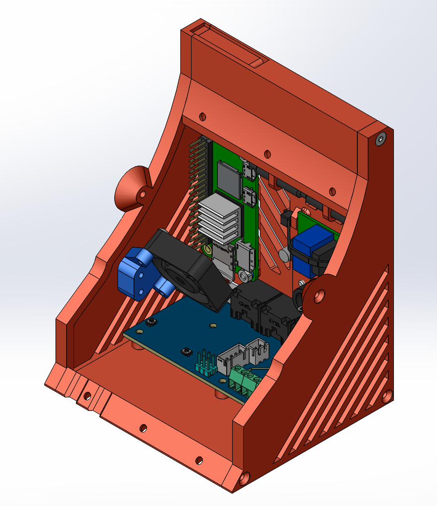
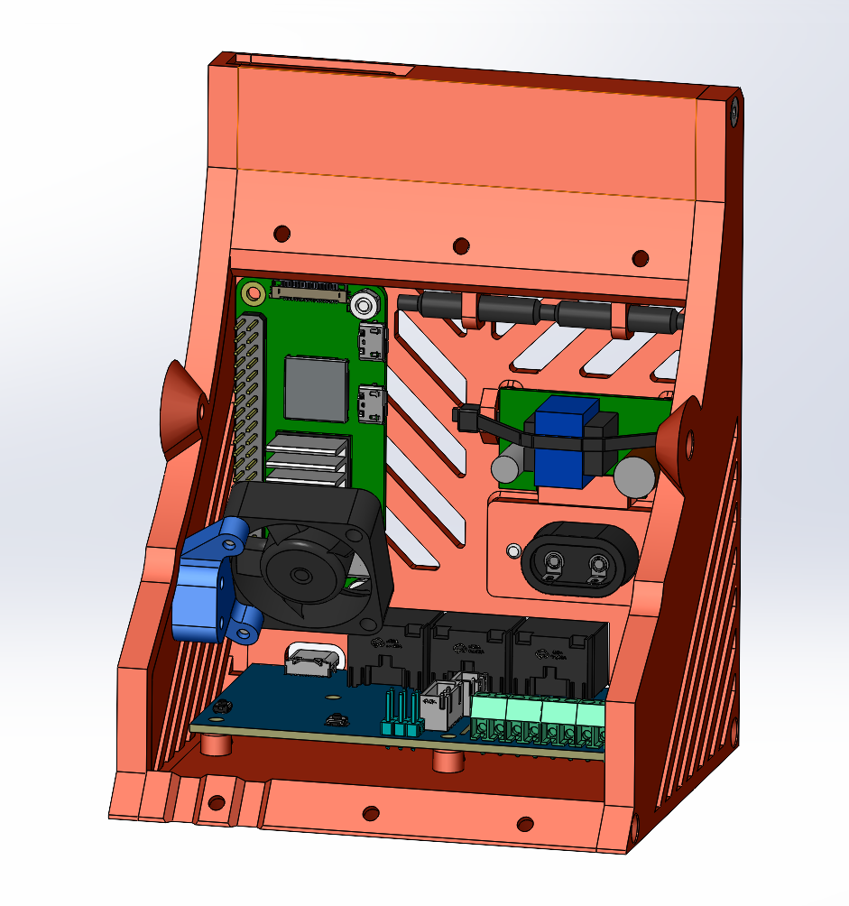
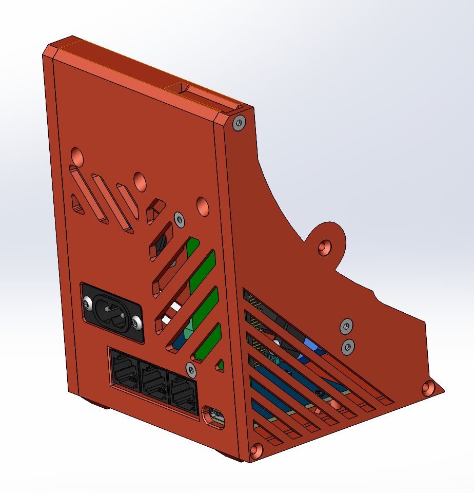

# [iDryer_StandAlone mod]

Модификация сушилки, позволяющая использовать её независимо от принтера за счёт увеличенного отсека электроники и OPi Zero 2w. Для максимальной компактности в части кабель-менеджемента крайне рекомендуется делать совместно с [UART mod](https://github.com/DieselFork/iDryer-Unit/tree/main/User-mods/hardware/UART%20mod).

>[!WARNING]
>Использование UART мода делается ценой работоспособности одного из разъёмов - можно будет подключить только 2 EXT платы.

## BOM

### Докупаемые детали

1. [Orange Pi Zero 2 W](https://aliexpress.ru/item/1005007543231333.html), желательно брать версию с 2 Гб памяти, с расчётом на дальнейшие модификации.
2. [Блок питания 5В, 2А](https://aliexpress.ru/item/1005001970797548.html?sku_id=12000018270798953), не менее. Если сделать не очень качественно серво-заслонку (шторка цепляется за корпус), то могут быть просадки по питанию.
3. [Вентилятор 3010, 5В](https://aliexpress.ru/item/4000256787938.html?sku_id=12000032631942721), столкнулся с тем, что в простое (без нагрева) температура OPi Zero 2w поднимается до 50 градусов, возможно, бракованная попалась.
4. [Радиатор 14х14х10 мм](https://aliexpress.ru/item/32956250962.html?sku_id=12000030307252205) для процессора OPi Zero 2w
5. Кабельный хомут 2,5х150, для крепления блока питания.
6. Винты с потайной головкой M3x10 DIN 7991 - 4 шт, для крепления OPi Zero 2w и кронштейна вентилятора. Можно заменить на M3x12 из пункта 7. 
7. Винты с потайной головкой M3x12 DIN 7991 - 2 шт, для верхней части отсека электроники.
8. Винты с полусферической головкой M3x14 ISO 225 - 2 шт, для крепления вентилятора 3010.
9. Гайки M3 DIN 934 - 2 шт, для крепления OPi Zero 2w.

### Печатаемые детали

1. Центральная часть EE_BackCover.
2. Боковые стенки EE_Side, правая/левая.

>[!WARNING]
>Обратите внимание на печатаемые модели - есть варианты для старой и новой платы.

3. Кронштейн вентилятора Fan_Bracket.

